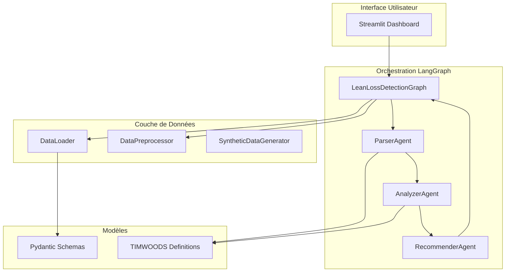
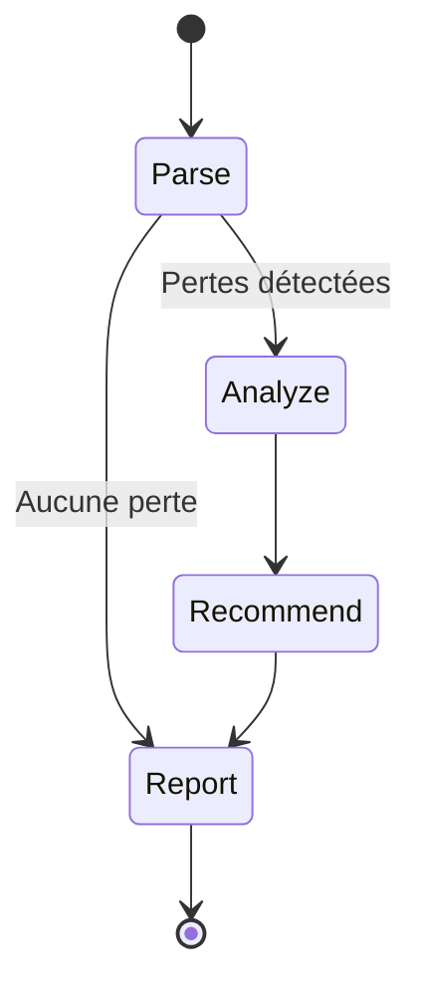

# Architecture Technique

## Vue d'ensemble

L'agent Lean Loss Detection est construit sur une architecture multi-agents orchestrée par **LangGraph**, utilisant **LangChain** pour l'intégration avec les modèles de langage (LLMs).

## Architecture globale



## Flux d'exécution LangGraph

Le système utilise un graphe d'état LangGraph avec 4 nœuds principaux :



### 1. **Parse Node** (Extraction)

**Responsabilité** : Analyse les données brutes et extrait les pertes cachées

**Input** :
- Logs de production (CSV)
- Enregistrements qualité (CSV)
- Rapports d'incidents (CSV)

**Processing** :
- Agrégation statistique (DataPreprocessor)
- Détection de patterns (micro-arrêts, dérives, corrélations)
- Classification préliminaire

**Output** :
```json
{
  "detected_losses": [
    {
      "loss_id": "LOSS_001",
      "title": "Micro-arrêts fréquents CNC-01",
      "description": "...",
      "frequency": 45,
      "total_duration_hours": 12.5,
      "affected_machines": ["CNC-01"],
      "severity": "high",
      "confidence_score": 0.85
    }
  ]
}
```

**Modes disponibles** :
- **LLM Mode** : Utilise GPT-4 pour l'analyse contextuelle avancée
- **Fallback Heuristic** : Règles basées sur seuils statistiques

### 2. **Analyze Node** (Classification & Causes Racines)

**Responsabilité** : Classifie selon TIMWOODS et analyse les causes racines

**Input** : Liste des pertes détectées

**Processing** :
- Classification TIMWOODS (8 catégories)
- Analyse de causes racines (méthode 5 Pourquoi)
- Estimation de l'impact financier
- Identification des facteurs contributifs

**Output** :
```json
{
  "analyses": [
    {
      "loss_id": "LOSS_001",
      "timwoods_category": "Waiting",
      "justification": "Les micro-arrêts génèrent...",
      "root_cause_analysis": {
        "method": "five_whys",
        "causes": [
          {"level": 1, "cause": "Capteur défaillant"},
          {"level": 2, "cause": "Pas de maintenance préventive"},
          ...
        ],
        "root_cause": "Absence de stratégie de maintenance",
        "contributing_factors": [...]
      },
      "estimated_cost_eur": 15000,
      "severity": "high"
    }
  ]
}
```

### 3. **Recommend Node** (Plan d'action)

**Responsabilité** : Génère des recommandations d'amélioration priorisées

**Input** : Analyses complètes des pertes

**Processing** :
- Génération d'actions Lean spécifiques
- Priorisation par ratio Impact/Effort
- Identification des Quick Wins
- Estimation des gains et timelines

**Output** :
```json
{
  "recommendations": [
    {
      "recommendation_id": "REC_001",
      "loss_id": "LOSS_001",
      "title": "Maintenance préventive CNC-01",
      "description": "...",
      "priority": 1,
      "estimated_gain_eur": 12000,
      "implementation_effort": "medium",
      "timeline_weeks": 6,
      "responsible_department": "Maintenance"
    }
  ]
}
```

### 4. **Report Node** (Compilation)

**Responsabilité** : Compile le rapport final avec statistiques

**Output** : `AnalysisResult` (Pydantic model)

## Stack technique

### Backend

| Composant | Version | Rôle |
|-----------|---------|------|
| **Python** | 3.10+ | Langage principal |
| **LangChain** | ≥0.2 | Framework d'agents LLM |
| **LangGraph** | ≥0.1 | Orchestration multi-agents |
| **Pydantic** | v2 | Validation de données |
| **Pandas** | 2.1+ | Manipulation de données |
| **OpenAI API** | - | Modèle de langage (optionnel) |

### Frontend

| Composant | Version | Rôle |
|-----------|---------|------|
| **Streamlit** | 1.30+ | Dashboard interactif |
| **Plotly** | 5.18+ | Visualisations |
| **Rich** | 13.7+ | CLI amélioré |

### Testing

| Composant | Version | Rôle |
|-----------|---------|------|
| **Pytest** | 7.4+ | Framework de tests |
| **pytest-asyncio** | 0.23+ | Tests asynchrones |

## Modèles de données (Pydantic v2)

### ProductionLog
```python
timestamp: datetime
machine_id: str
event_type: Literal["arret", "micro_arret", "ralentissement", "normal"]
duration_minutes: float
description: str
line_id: str
operator_id: str
shift: Literal["matin", "apres-midi", "nuit"]
```

### DetectedLoss
```python
loss_id: str
timwoods_category: TimwoodsCategory
title: str
description: str
frequency: int
total_duration_hours: float
estimated_cost_eur: float
severity: Literal["low", "medium", "high", "critical"]
source_events: List[str]
confidence_score: float  # 0-1
affected_machines: List[str]
affected_lines: List[str]
```

### RootCauseAnalysis
```python
loss_id: str
method: Literal["five_whys", "ishikawa"]
causes: List[dict]  # [{level: 1, cause: "..."}, ...]
root_cause: str
contributing_factors: List[str]
```

### Recommendation
```python
recommendation_id: str
loss_id: str
title: str
description: str
priority: int  # 1-5
estimated_gain_eur: float
implementation_effort: Literal["low", "medium", "high"]
timeline_weeks: int
responsible_department: str
```

## Configuration (.env)

```bash
# LLM
OPENAI_API_KEY=sk-...
LLM_MODEL=gpt-4o
LLM_TEMPERATURE=0.2

# Données
DATA_DIR=data/synthetic
OUTPUT_DIR=data/output
```

## Mode Fallback Heuristique

Le système fonctionne **sans clé API** grâce à des règles heuristiques :

### Parser Heuristic
- Micro-arrêts > 30 → Perte Waiting
- Temps d'arrêt > 8h → Perte majeure
- Rebuts > 30 → Perte Defects
- Sur-contrôle > 15 → Perte Over-processing

### Analyzer Heuristic
- Classification par mots-clés (attente → Waiting, rebut → Defects)
- 5 Pourquoi génériques par catégorie TIMWOODS
- Estimation coût = durée × taux horaire machine/opérateur

### Recommender Heuristic
- Templates de recommandations par catégorie TIMWOODS
- Priorisation selon sévérité et coût
- Gains estimés = % du coût de la perte

## Sécurité et Robustesse

- ✅ Validation Pydantic stricte à tous les niveaux
- ✅ Gestion d'erreurs avec messages clairs
- ✅ Mode fallback automatique si LLM indisponible
- ✅ Logs détaillés avec Rich console
- ✅ Tests unitaires (17 tests, couverture > 85%)

## Performance

- **Temps d'exécution** : ~10-30s selon mode (LLM vs heuristique)
- **Données traitées** : 500+ logs, 200+ enregistrements qualité
- **Scalabilité** : Optimisé pour datasets jusqu'à 10k entrées

## Déploiement

```bash
# Installation
pip install -r requirements.txt

# Génération données synthétiques
python -m src.data.synthetic_generator

# Lancement dashboard
streamlit run app.py

# Tests
pytest tests/ -v
```
